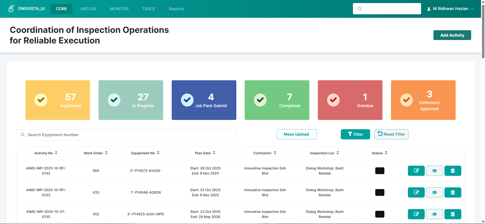
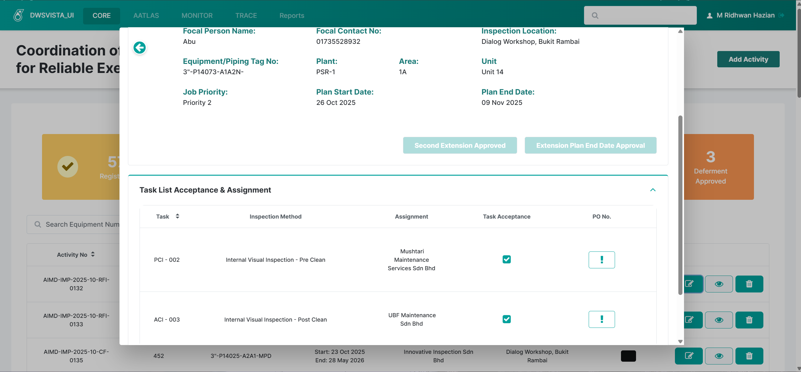
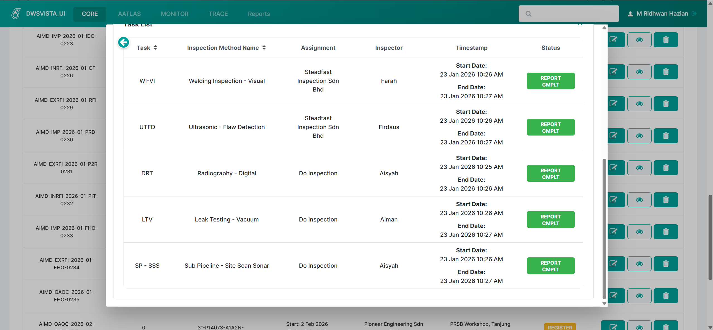
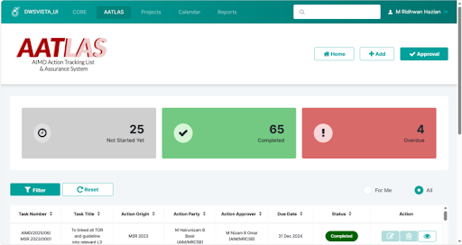
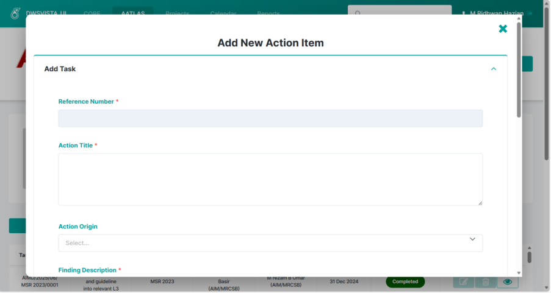
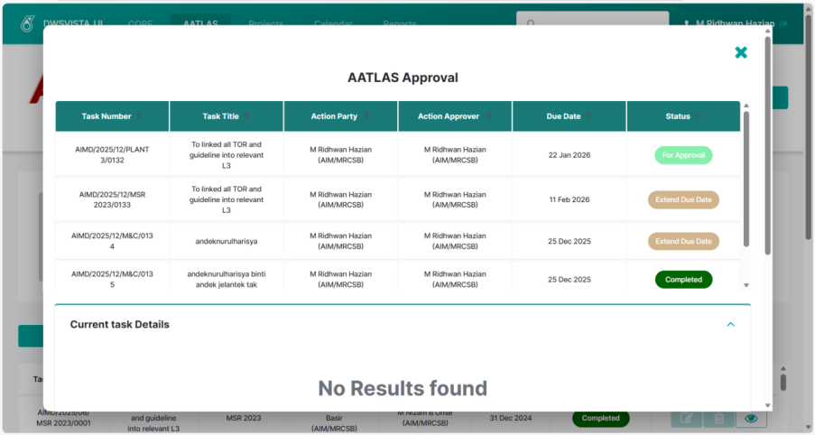
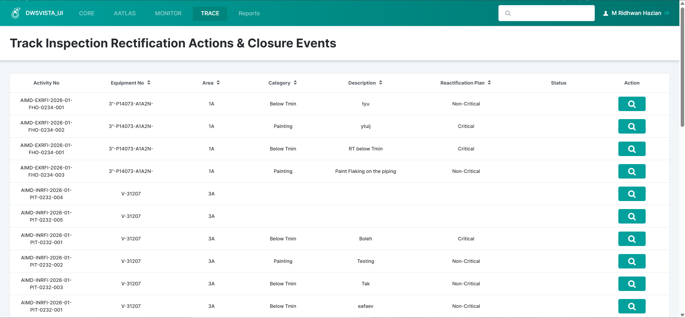
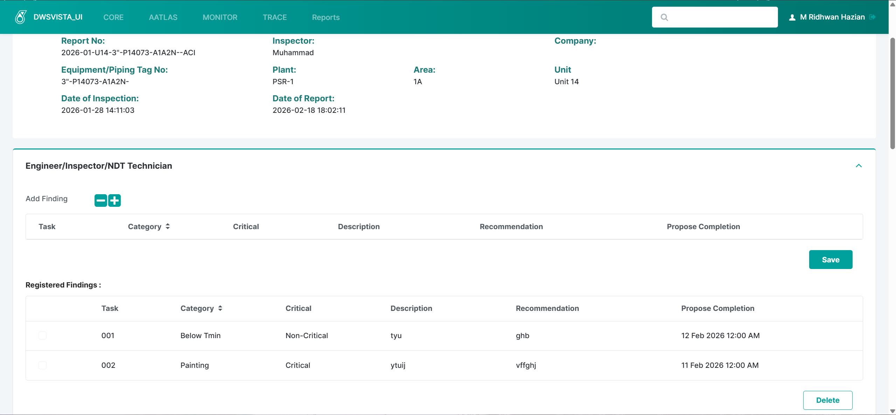

# 🚀 VISTA – Visibility into Inspection Scheduling, Tracking & Assurance

---

## 🌟 Overview
**VISTA (Visibility into Inspection Scheduling, Tracking & Assurance)** is a suite of internal systems built using the OutSystems low-code platform to support inspection operations, task tracking, and workflow automation.

The ecosystem consists of three integrated modules — **CORE, AATLAS, and TRACE** — working together to improve visibility, coordination, and reporting of inspection and maintenance activities.

💼 During my internship at **Malaysian Refining Company Sdn Bhd (MRCSB)**, VISTA was my primary project.  
I contributed to system enhancement, bug fixing, workflow logic, UI improvements, and documentation to support ongoing operations and future interns.

CORE and TRACE were originally developed by senior interns **Khamsa Athiirah** and **Andek Nurul Harisya**, who built the initial foundations.  
After their internship ended, I continued the development and improvements together with fellow intern **Wan Qistina**.

Wan Qistina contributed mainly to UI improvements, while I focused more on **system logic, workflows, and backend behavior**.

AATLAS, however, involved a full migration effort that I handled.

---

# 🔐 Authentication & Access Control

VISTA does **not use a traditional sign-up or sign-in page** inside the application.

Instead:

- Authentication is handled through the company’s secure enterprise login system (Microsoft-based SSO)  
- Users access VISTA using their company email and credentials  
- Login validation is managed at the server/identity provider level  

### Admin Access Management
VISTA includes an internal **Access Management admin module** where:

- Users must be manually registered  
- Roles and permissions are controlled  
- Only authorized staff can access specific functions  

✅ This approach improves security and ensures controlled system access.

---

# 🧩 Modules

---

## 🔹 CORE  
### *Coordination of Inspection Operations for Reliable Execution*

> CORE foundation was built by senior interns.  
> My role focused on deeper improvements, enhancements, and maintenance.

### 📌 Purpose
- Manage inspection activities and records  
- Update task details and statuses  
- Provide structured tracking for ongoing work  

### 🛠️ My Contributions
- Deep improvements on **Edit Activity popup logic**
- Enhanced status handling and tracking flows  
- Improved dashboard filtering and visibility  
- Fixed workflow issues and logic inconsistencies  
- Participated in workflow and status design discussions  

👉 CORE is where I contributed the most technically and dove deeper into system logic.

---

## 🔹 AATLAS  
### *AIMD Action Tracking List & Assurance System*

### 📌 Purpose
- Handle inspection data and records  
- Support inspection workflows  
- Enable notification-based tracking  

### 🛠️ Key Contributions (Major Project)
- ✅ **Performed full migration of AATLAS from Power Apps to OutSystems**
- Rebuilt features natively in OutSystems  
- Created AATLAS OutSystems guideline for future interns  
- Documented client actions, server actions, and flows  
- Troubleshot file preview issues  
- Improved workflow usability  
- Removed dependency on Power Platform after migration  

### ⚡ Power Apps & Automation Contributions (Legacy)
Before migration, AATLAS operated using Power Apps + Power Automate:

- Built and improved Power Apps features  
- Implemented **Extend Due Date** logic  
- Connected Power Apps to Power Automate for:
  - Email notifications  
  - Task alerts  
  - Priority tracking  

👉 After migration, OutSystems handled these processes natively.

---

## 🔹 TRACE  
### *Track Inspection Rectification Actions & Closure Events*

> TRACE foundation was built by senior interns.  
> My work focused on improvements and fixes.

### 📌 Purpose
- Track inspection findings  
- Monitor task progress via statuses  
- Improve traceability of issues and actions  

### 🛠️ My Contributions
- Fixed server actions to prevent duplicate records  
- Corrected accordion logic using local variable IDs  
- Linked findings correctly to task IDs  
- Supported status design discussions  
- Suggested UI improvements  
- Performed system stabilization and enhancements  

---

# 📸 System Screenshots

### CORE Module

  
  
  

### AATLAS Module

  
  
  

### TRACE Module

  
  

---

# 👨‍💻 My Role

🎯 **Position:** Intern Low-Code Developer & System Contributor  

### ✅ Responsibilities
- Enhancing system logic  
- Debugging workflow/server action issues  
- Supporting UI improvements  
- Creating documentation & guidelines  
- Assisting automation configurations  
- Testing and troubleshooting  

---

# 📚 Documentation & Knowledge Transfer

To support future interns:

- 📘 Created AATLAS & CORE guidelines  
- 📘 Covered both OutSystems and legacy Power Apps  
- 🧭 Documented system purposes and flows  
- 🤝 Improved onboarding clarity  

Focus was on **what the system does and why**, not teaching OutSystems itself.

---

# 🛠️ Skills Demonstrated

- Low-code Development (OutSystems)  
- Microsoft Power Apps & Power Automate  
- Workflow Logic Design  
- Debugging & Troubleshooting  
- Technical Documentation  
- Automation Integration  
- UI/UX Awareness  
- Team Collaboration  

---

# 📈 Impact

✨ VISTA improves:

- Inspection visibility  
- Task tracking  
- Reporting clarity  
- Workflow efficiency  
- Team awareness via notifications  

My contributions helped stabilize features, improve maintainability, and support future knowledge transfer.

---

# 📄 Project Report

📥 **Internship Technical Report**

👉 [Download Report Outsystem (PDF)](https://raw.githubusercontent.com/RidhwanHazian/OutsystemProject/main/Report%20Outsystem%20Practical%20Training.pdf)

---

# 💡 Reflection

Working on VISTA provided exposure to:

- Enterprise system environments  
- Real operational systems  
- Cross-team collaboration  
- Balancing technical and documentation tasks  

This experience strengthened both my **technical** and **professional** skills beyond academic learning.

---

# 👤 Author

**Muhammad Ridhwan bin Hazian**  
Diploma in Computer Science  
Intern Developer (OutSystems & Automation)  
Internship at Malaysian Refining Company Sdn Bhd (MRCSB)
